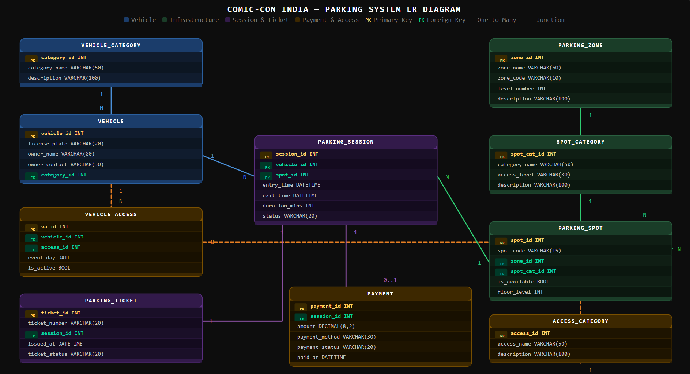

# Comic-Con India — Parking System ER Diagram

## Overview
This is a database design for a multi-zone event parking system built for Comic-Con India.
The system handles vehicle entry/exit, spot allocation, reserved categories, sessions, tickets and payments.

## ER Diagram

## Entities
| Entity | Description |
|---|---|
| VEHICLE | Stores all vehicles entering the venue |
| VEHICLE_CATEGORY | Type of vehicle: bike, car, SUV, cab, EV |
| PARKING_ZONE | Zone/level inside the venue |
| SPOT_CATEGORY | Reserved types: VIP, EV, Exhibitor, Staff |
| PARKING_SPOT | Individual parking spots with availability |
| PARKING_SESSION | Entry/exit timestamp per vehicle visit |
| PARKING_TICKET | Ticket issued per session |
| PAYMENT | Payment record linked to each session |
| ACCESS_CATEGORY | Special access roles: VIP, cosplayer, staff |
| VEHICLE_ACCESS | Junction table: vehicle ↔ access category |

## Key Design Decisions
- One vehicle can have multiple sessions across event days
- One parking spot can be reused across many sessions
- Tickets and sessions are separate entities
- Payments are linked to sessions, not tickets
- Special access is handled via a junction table (many-to-many)
